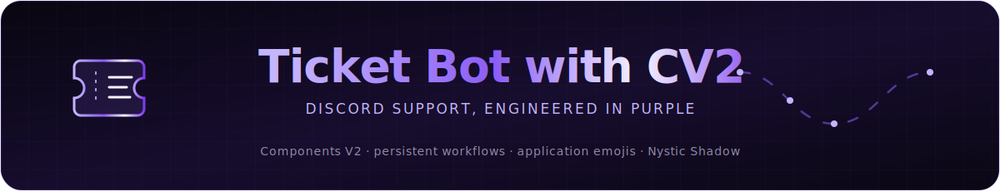
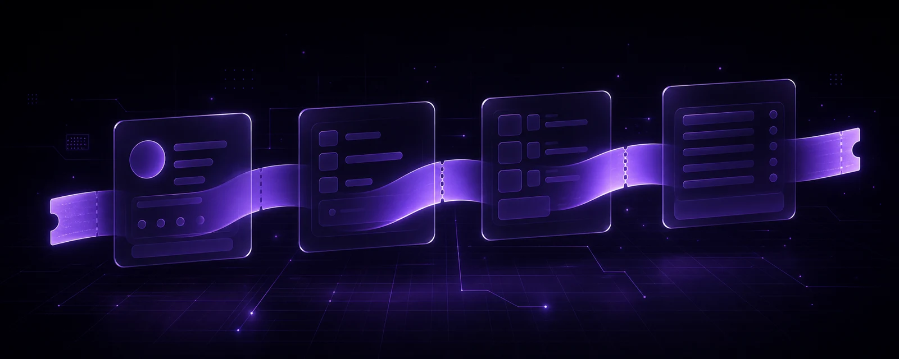
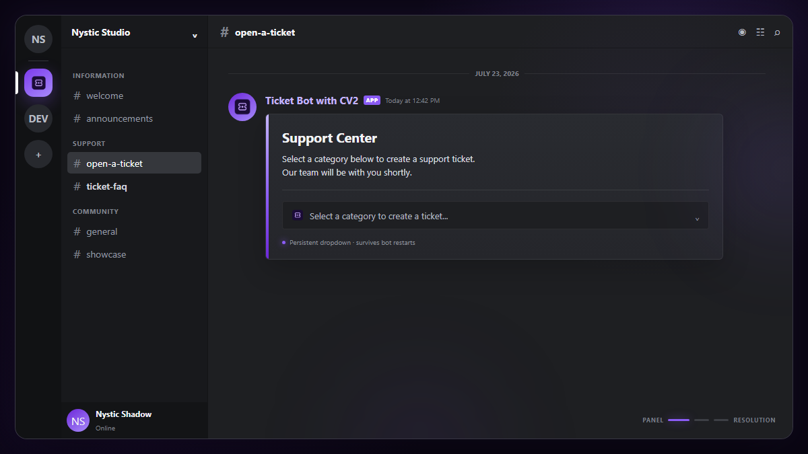
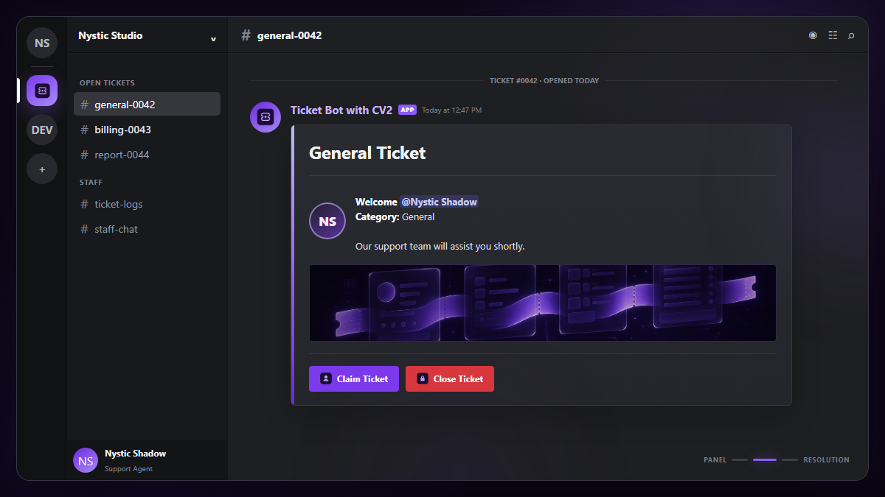
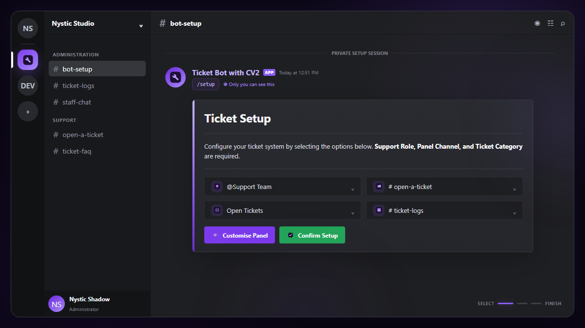
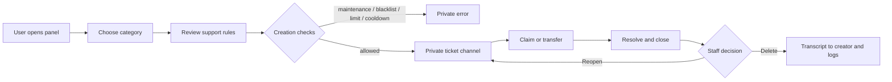

<p align="center">
  
</p>

<p align="center">
  <a href="https://github.com/Nystic-Shadow/TICKET-BOT-CV2/actions/workflows/ci.yml"></a>
  
  
  
</p>

<p align="center">
  An advanced, multi-server Discord ticket system built with <strong>discord.py Components V2</strong>.<br>
  Persistent panels, guided ticket creation, staff workflows, transcripts, reminders, triggers, and application-owned emojis—ready for local, Docker, VPS, Railway, Render, or panel hosting.
</p>

<p align="center"><strong>Developed by Nystic Shadow</strong></p>

<p align="center">
  
</p>

## Why this bot

Ticket Bot with CV2 is designed for communities that want a polished support workflow without a separate dashboard or JSON configuration file. Server administrators configure the ticket system inside Discord, while deployment settings and secrets live in environment variables.

The running bot automatically uses the name and avatar configured in the Discord Developer Portal. No bot name, application branding, token, server ID, role ID, or channel ID is hard-coded.

| Area | Implementation |
|---|---|
| Interface | Discord Components V2 using `LayoutView`, `Container`, `TextDisplay`, selects, buttons, media galleries, and files |
| Configuration | Guided `/setup` wizard plus `.env` or host-provided environment variables |
| Storage | Per-server SQLite state with WAL mode, indexes, migrations, and restart-safe reminders |
| Panels | Persistent dropdown or button panels that continue working after restarts |
| Theme | Violet `#8B5CF6` surfaces with 27 matching application-emoji assets |
| Deployment | Native Python, Docker Compose, Docker, Railway, Render, Linux service, Windows, or Pterodactyl |
| Identity | Name and avatar come directly from the Discord application |
| License | MIT |

## Contents

- [Interface previews](#interface-previews)
- [Features A–Z](#features-az)
- [Ticket lifecycle](#ticket-lifecycle)
- [Commands](#commands)
- [Discord application setup](#discord-application-setup)
- [Environment variables](#environment-variables)
- [Local installation](#local-installation)
- [First server setup](#first-server-setup)
- [Deployment](#deployment)
- [Purple application emojis](#purple-application-emojis)
- [Storage and backups](#storage-and-backups)
- [Project structure](#project-structure)
- [Development and CI](#development-and-ci)
- [Security](#security)
- [Troubleshooting](#troubleshooting)
- [License](#license)

## Interface previews

These previews are deterministic renders based on the bot's actual Components V2 layout code and tracked purple emoji assets.

<table>
  <tr>
    <td width="50%">
      
      <p align="center"><strong>Persistent ticket panel</strong><br>Dropdown and button modes are supported.</p>
    </td>
    <td width="50%">
      
      <p align="center"><strong>Ticket controls</strong><br>Claim, close, banner, creator, and category context.</p>
    </td>
  </tr>
</table>

<p align="center">
  
  <br>
  <strong>Private setup wizard</strong> — configure roles, channels, ticket category, logs, panel copy, color, and image without editing source files.
</p>

## Features A–Z

| | Feature | What it does |
|---:|---|---|
| A | Application-owned emojis | Syncs the 27 tracked purple PNGs to the Discord application through the official API—never to individual servers. |
| B | Button or dropdown panels | Publishes category buttons or a select menu, with up to 25 configured categories. |
| C | Claim controls | Lets staff claim tickets with an atomic database update that prevents two agents claiming simultaneously. |
| D | Durable per-server data | Isolates configuration, tickets, roles, limits, blacklists, panels, and reminders by guild ID. |
| E | Environment-first configuration | Loads local `.env` values while allowing production host variables to take priority. |
| F | FAQ navigator | Provides an interactive Components V2 FAQ for users and staff. |
| G | Guild-aware operation | Supports multiple Discord servers from one bot process with independent settings. |
| H | Help and health commands | Includes interactive help, bot information, and latency checks. |
| I | Interaction safety | Uses ephemeral responses where appropriate and restricts automatic mentions. |
| J | Just-in-time panel refresh | Updates the published panel when an administrator adds or removes ticket categories. |
| K | Keyword triggers | Stores cached, case-insensitive, exact-match automatic responses per server. |
| L | Limits and logs | Enforces per-user ticket limits and writes creation, claim, close, and deletion events to the configured log channel. |
| M | Maintenance mode | Temporarily blocks new ticket creation without affecting existing tickets. |
| N | Native bot identity | Reads the bot name and avatar from the Discord Developer Portal automatically. |
| O | Open, close, and reopen lifecycle | Removes creator send access on close and restores it on staff reopen. |
| P | Persistent components | Re-registers panel, ticket-control, and closed-ticket views after every restart. |
| Q | Queue-safe creation | Uses a per-guild creation lock plus a unique ticket-number index to avoid duplicate channels and numbers. |
| R | Reminders and rate limits | Persists follow-up reminders for 1 minute to 7 days and applies per-server creation cooldowns. |
| S | Setup wizard and support roles | Configures a primary support role and any number of additional support roles. |
| T | Transcripts and transfer | Sends text transcripts to the creator and log channel when deleted, and allows staff reassignment. |
| U | User access management | Lets staff add or remove members from an active ticket channel. |
| V | Variable templates | Supports user, ticket, server, channel, time, claim, and close placeholders. |
| W | Webhook submission | Uses a one-time webhook to present the creator's ticket reason cleanly, with a normal-message fallback. |
| X | eXact-match autoresponders | Responds only when a message exactly matches a configured trigger after case folding and trimming. |
| Y | Your panel design | Supports a custom title, description, accent color, and public direct image URL. |
| Z | Zero secrets in source | Keeps tokens, runtime databases, logs, manifests, and local `.env` files out of Git. |

## Ticket lifecycle



Before a channel is created, the bot rechecks maintenance mode, blacklist status, cooldown, open-ticket limit, and the next ticket number inside the per-server creation lock. If the database insert fails after Discord creates the channel, the bot removes that channel as a rollback.

## Commands

Most commands are hybrid commands, so both `/command` and the configured prefix form such as `!command` are available. Slash commands are recommended.

### Everyone

| Command | Purpose |
|---|---|
| `/help` | Open the interactive command guide. |
| `/botinfo` | Show the portal-defined bot identity, runtime versions, creation date, and server count. |
| `/ping` | Show Gateway latency. |
| `/faq` | Open the interactive ticket FAQ. |
| `/variables` | List every supported message variable. |
| `/trigger get <keyword>` | Inspect one configured exact-match trigger. |
| `/trigger list` | List active triggers for the current server. |

### Ticket members and staff

| Command | Access | Purpose |
|---|---|---|
| `/close` | Creator or support staff | Close the current ticket and show persistent delete/reopen controls. |
| `/ticket info` | Ticket channel access | Show creator, timeline, message count, status, and access list. |
| `/remind <time> [message]` | Ticket channel or support staff | Schedule a persistent follow-up using `5m`, `1h`, or `2d`. |
| `/claim` | Support staff | Claim an unclaimed ticket. |
| `/reopen` | Support staff | Reopen a closed ticket and restore creator access. |
| `/rename <name>` | Support staff | Sanitize and rename the current ticket channel. |
| `/ticket transfer <member>` | Support staff | Assign the ticket to another support member. |
| `/ticket adduser <user>` | Support staff | Grant a user access to the ticket. |
| `/ticket removeuser <user>` | Support staff | Remove a user's ticket overwrite. |
| `/category list` | Support staff | Display the configured ticket categories. |

Administrators count as support staff throughout the permission checks.

### Administrators

| Command | Purpose |
|---|---|
| `/setup` | Launch the private Components V2 setup wizard. |
| `/sendpanel dropdown` | Publish or replace the persistent dropdown panel. |
| `/sendpanel button` | Publish or replace the persistent button panel. |
| `/category add <name> [emoji]` | Add a ticket category and refresh the panel. |
| `/category remove <name>` | Remove a ticket category and refresh the panel. |
| `/category reset` | Remove all configured ticket categories. |
| `/setlimit <1-10>` | Set the maximum open tickets per user. |
| `/supportrole add <role>` | Add another role that can manage tickets. |
| `/supportrole remove <role>` | Remove an additional support role. |
| `/supportrole list` | Show the primary and additional support roles. |
| `/blacklist add <user>` | Block a user from opening new tickets. |
| `/blacklist remove <user>` | Restore a user's ability to open tickets. |
| `/blacklist list` | Show the server blacklist. |
| `/maintenance` | Toggle ticket creation on or off. |
| `/announce <message>` | Send one Components V2 announcement to every open ticket. |
| `/trigger add <keyword> <message>` | Add a 1–50 character exact-match trigger. |
| `/trigger remove <keyword>` | Delete an exact-match trigger. |

The prefix-only `!sync` command is restricted to the application owner and manually synchronizes global application commands.

## Discord application setup

### 1. Create the application

1. Open the [Discord Developer Portal](https://discord.com/developers/applications).
2. Select **New Application** and choose any name.
3. Open **Bot**, create the bot user if needed, and set the name and avatar you want users to see.
4. Reset/copy the bot token and store it only in `DISCORD_TOKEN`.

Treat the bot token like a password. Never paste it into Python files, screenshots, commits, issues, or chat messages.

### 2. Enable the required intents

Under **Bot → Privileged Gateway Intents**, enable:

- **Server Members Intent**
- **Message Content Intent**

The bot requests both in `main.py`. Member data supports role and ticket-author workflows; message content supports prefix commands and exact-match triggers. Discord explains the enablement and verification rules in its [Gateway documentation](https://docs.discord.com/developers/events/gateway#privileged-intents).

### 3. Configure installation

Under **Installation → Default Install Settings**, configure a **Guild Install** with:

- `bot`
- `applications.commands`

Request only the permissions required by the workflow:

- View Channels
- Send Messages
- Read Message History
- Manage Channels
- Manage Roles
- Manage Messages
- Manage Webhooks
- Attach Files

Administrator permission is not required. Place the bot's role above roles whose channel overwrites it must manage. Discord's [installation guide](https://docs.discord.com/developers/quick-start/getting-started#adding-scopes-and-bot-permissions) and [permissions overview](https://docs.discord.com/developers/platform/oauth2-and-permissions) explain the scopes and permission model.

### 4. Install to a test server

Use the install link from the portal, select a server you manage, and test the complete lifecycle there before deploying to a production community.

## Environment variables

Copy `.env.example` to `.env`. The application loads the project-root `.env` automatically for local development. Existing process or hosting-platform variables are never overwritten, so production secret managers remain authoritative.

### Required

| Variable | Example | Description |
|---|---|---|
| `DISCORD_TOKEN` | `your_token_here` | Bot token from the Developer Portal. Secret; never commit it. |

### Bot behavior and presentation

| Variable | Default | Description |
|---|---|---|
| `BOT_PREFIX` | `!` | Prefix for hybrid/prefix commands. |
| `BOT_STATUS` | `!help \| /help` | Activity text shown in Discord. |
| `BOT_STATUS_TYPE` | `WATCHING` | `PLAYING`, `WATCHING`, `LISTENING`, `STREAMING`, `IDLE`, `DND`, or `INVISIBLE`. |
| `STREAM_URL` | empty | Public stream URL used only with `BOT_STATUS_TYPE=STREAMING`. |
| `SUPPORT_SERVER_URL` | empty | Optional Discord invite shown in help and mention responses. |
| `DEFAULT_PANEL_FOOTER` | `Developed by Nystic Shadow` | Default footer value stored with new ticket configuration. |
| `TICKET_BANNER_URL` | empty | Public direct image URL shown above the **Claim Ticket** and **Close Ticket** buttons. |
| `TICKET_RULES_TEXT` | built-in sentence | Rules shown before the user confirms ticket creation. Use `\n` for line breaks. |

`TICKET_BANNER_URL` must be a direct, publicly reachable image URL. A webpage containing an image is not the same as the image URL itself.

### Runtime, logging, and emoji sync

| Variable | Default | Description |
|---|---|---|
| `DATABASE_PATH` | `bot.db` | Primary SQLite database path. |
| `TRIGGERS_DATABASE_PATH` | `triggers.db` | Exact-match trigger database path. |
| `LOG_PATH` | `bot.log` | Rotating application log path. |
| `LOG_LEVEL` | `INFO` | Python logging level such as `INFO`, `WARNING`, or `DEBUG`. |
| `AUTO_SYNC_APPLICATION_EMOJIS` | `true` | Sync tracked purple assets to the Discord application during startup. |
| `EMOJI_DIRECTORY` | `emojis` | Local emoji assets and generated manifest directory. |
| `DISCORD_APPLICATION_ID` | empty | Needed only by the optional manual emoji-sync script; normal startup discovers it. |

## Local installation

### Windows PowerShell

```powershell
git clone https://github.com/Nystic-Shadow/TICKET-BOT-CV2.git
Set-Location TICKET-BOT-CV2

py -3.12 -m venv .venv
.\.venv\Scripts\Activate.ps1
python -m pip install --upgrade pip
python -m pip install -r requirements.txt

Copy-Item .env.example .env
notepad .env
python main.py
```

If PowerShell blocks activation for the current session:

```powershell
Set-ExecutionPolicy -Scope Process Bypass
.\.venv\Scripts\Activate.ps1
```

### Linux or macOS

```bash
git clone https://github.com/Nystic-Shadow/TICKET-BOT-CV2.git
cd TICKET-BOT-CV2

python3 -m venv .venv
source .venv/bin/activate
python -m pip install --upgrade pip
python -m pip install -r requirements.txt

cp .env.example .env
nano .env
python main.py
```

A successful startup initializes both databases, synchronizes application emojis, loads five extensions, registers persistent views, synchronizes slash commands, sets the portal-defined bot presence, and prints the ready state.

## First server setup

1. Run `/setup` as a server administrator.
2. Select the primary **Support Role**.
3. Select the **Panel Channel**.
4. Select the Discord **Category** where ticket channels should be created.
5. Optionally select a **Log Channel**.
6. Select **Customise Panel** to set title, description, violet/custom accent, and a direct panel image URL.
7. Confirm the preview and finish setup.
8. Add categories, for example `/category add General`.
9. Publish the panel with `/sendpanel dropdown` or `/sendpanel button`.
10. Open a test ticket and verify claim, close, reopen, transcript, and delete behavior.

Panel images configured in `/setup` appear on the public ticket-opening panel. `TICKET_BANNER_URL` is separate and appears inside every newly created ticket above the claim/close controls.

## Deployment

This project is a long-running Discord Gateway worker. It does **not** expose an HTTP port and should not be deployed as a static site, serverless function, or cron job.

### Deployment matrix

| Target | Recommended mode | Persistent storage |
|---|---|---|
| Local development | Native Python + `.env` | Project directory |
| Docker host or NAS | `docker compose` | Included named volume |
| Railway | Root `Dockerfile` | Volume mounted at `/app/data` |
| Render | Docker background worker | Persistent disk mounted at `/app/data` |
| Linux VPS | Virtual environment + `systemd` | `/opt/...` or another durable path |
| Windows server | Virtual environment + Task Scheduler/service manager | Local durable directory |
| Pterodactyl | Python egg/process | Server allocation directory |

Because the project uses SQLite and an in-process creation lock, run **exactly one bot instance** against a database. Do not horizontally scale replicas that share the same SQLite files.

### Docker Compose — recommended

Docker Compose loads `.env`, builds the included non-root image, restarts the bot unless stopped, and stores databases/logs in a named volume.

```powershell
Copy-Item .env.example .env
notepad .env
docker compose up -d --build
docker compose logs -f bot
```

Linux/macOS uses `cp .env.example .env` instead of `Copy-Item`.

Useful lifecycle commands:

```bash
docker compose ps
docker compose restart bot
docker compose logs --tail 200 bot
docker compose down
```

`docker compose down` preserves the named volume. Do not add `--volumes` unless you intentionally want to delete the bot's databases and logs. Docker documents `.env`/`env_file` behavior in its [Compose environment guide](https://docs.docker.com/compose/how-tos/environment-variables/set-environment-variables/).

### Plain Docker

```bash
docker build -t ticket-bot-cv2 .
docker volume create ticket-bot-data

docker run -d \
  --name ticket-bot-cv2 \
  --restart unless-stopped \
  --env-file .env \
  -e DATABASE_PATH=/app/data/bot.db \
  -e TRIGGERS_DATABASE_PATH=/app/data/triggers.db \
  -e LOG_PATH=/app/data/bot.log \
  -v ticket-bot-data:/app/data \
  ticket-bot-cv2
```

### Railway

1. Push or fork this repository.
2. Create a Railway project and deploy from the GitHub repository.
3. Railway automatically detects the root `Dockerfile`.
4. Open the service **Variables** tab and paste the contents of `.env`; fill `DISCORD_TOKEN`.
5. Add a Railway volume mounted at `/app/data`.
6. Set:

```dotenv
DATABASE_PATH=/app/data/bot.db
TRIGGERS_DATABASE_PATH=/app/data/triggers.db
LOG_PATH=/app/data/bot.log
```

7. Do not generate a public domain or configure a health-check path; this bot has no web server.
8. Keep one replica.

Railway documents root Dockerfile detection, raw environment-variable import, and `/app/data` volume mounts in its [Dockerfile](https://docs.railway.com/builds/dockerfiles), [variables](https://docs.railway.com/variables), and [volumes](https://docs.railway.com/volumes) guides.

### Render

1. Create a **Background Worker**, not a Web Service.
2. Connect the GitHub repository and choose the Docker runtime.
3. Let Render use the root `Dockerfile`.
4. Add environment variables from `.env` and provide `DISCORD_TOKEN`.
5. Attach a persistent disk at `/app/data`.
6. Set the three runtime paths to `/app/data/bot.db`, `/app/data/triggers.db`, and `/app/data/bot.log`.
7. Deploy one worker instance.

Render background workers are intended for continuous processes without inbound traffic. Render filesystems are ephemeral by default, and persistent disks for workers require a supported paid plan; see the official [service types](https://render.com/docs/service-types), [environment variables](https://render.com/docs/configure-environment-variables), and [persistent disks](https://render.com/docs/disks) documentation.

### Linux VPS with systemd

Example for a Debian/Ubuntu-style server:

```bash
sudo useradd --system --create-home --home-dir /opt/ticket-bot ticketbot
sudo git clone https://github.com/Nystic-Shadow/TICKET-BOT-CV2.git /opt/ticket-bot/app
sudo chown -R ticketbot:ticketbot /opt/ticket-bot

sudo -u ticketbot python3 -m venv /opt/ticket-bot/app/.venv
sudo -u ticketbot /opt/ticket-bot/app/.venv/bin/python -m pip install -r /opt/ticket-bot/app/requirements.txt
sudo -u ticketbot cp /opt/ticket-bot/app/.env.example /opt/ticket-bot/app/.env
sudo chmod 600 /opt/ticket-bot/app/.env
sudo nano /opt/ticket-bot/app/.env
```

Create `/etc/systemd/system/ticket-bot.service`:

```ini
[Unit]
Description=Ticket Bot with CV2
After=network-online.target
Wants=network-online.target

[Service]
Type=simple
User=ticketbot
Group=ticketbot
WorkingDirectory=/opt/ticket-bot/app
EnvironmentFile=/opt/ticket-bot/app/.env
ExecStart=/opt/ticket-bot/app/.venv/bin/python /opt/ticket-bot/app/main.py
Restart=on-failure
RestartSec=5
TimeoutStopSec=30

[Install]
WantedBy=multi-user.target
```

Enable and inspect it:

```bash
sudo systemctl daemon-reload
sudo systemctl enable --now ticket-bot
sudo systemctl status ticket-bot
sudo journalctl -u ticket-bot -f
```

### Windows always-on host

1. Complete the Windows local installation.
2. Keep the project in a permanent directory, not a temporary download folder.
3. Create a Task Scheduler task triggered **At startup**.
4. Set the program to `.venv\Scripts\python.exe`.
5. Set the argument to the absolute path of `main.py`.
6. Set **Start in** to the repository directory so `.env`, databases, emojis, and logs resolve correctly.
7. Configure restart on failure and run whether the user is logged in or not.

### Pterodactyl or another Python panel

- Runtime: Python 3.11 or newer
- Install command: `python -m pip install -r requirements.txt`
- Startup command: `python main.py`
- Working directory: repository root
- Network port: not required by the bot
- Secrets: use panel variables where available; otherwise upload a private `.env`
- Persistence: keep `bot.db`, `triggers.db`, WAL files, logs, and `emojis/manifest.json` on durable storage

## Purple application emojis

The source retains the original custom-emoji names and references, while `emojis/purple/` provides 27 coordinated violet PNGs. At startup, the synchronizer:

1. Scans runtime Python files for legacy custom-emoji mentions.
2. Prefers the tracked purple PNG for each mention.
3. Lists the application's current emoji inventory.
4. Reuses matching application emojis when possible.
5. Uploads missing artwork with the bot token.
6. Stages changed artwork before deleting the old emoji.
7. Rolls back the staged upload if old-emoji deletion fails.
8. Writes `emojis/manifest.json` with the old-to-new ID mapping and SHA-256 hashes.
9. Resolves legacy mentions to the current application emoji IDs at runtime.

The synchronizer calls only Discord's application endpoints under `/applications/{application_id}/emojis`. It never calls a guild/server emoji endpoint. Discord documents the list, create, modify, delete, and 256 KiB asset limit in the official [Emoji Resource](https://docs.discord.com/developers/resources/emoji).

Automatic sync is enabled by default:

```dotenv
AUTO_SYNC_APPLICATION_EMOJIS=true
EMOJI_DIRECTORY=emojis
```

Download/manifest refresh without credentials:

```bash
python -m scripts.sync_application_emojis --download-only
```

Manual application upload using `.env`:

```dotenv
DISCORD_TOKEN=your_bot_token
DISCORD_APPLICATION_ID=your_application_id
```

```bash
python -m scripts.sync_application_emojis
```

If Discord or its CDN is temporarily unavailable, normal startup continues with the last valid local mapping. Set `AUTO_SYNC_APPLICATION_EMOJIS=false` to disable startup network synchronization.

## Storage and backups

The bot creates runtime data only when it runs:

| Path | Contents |
|---|---|
| `bot.db` | Server configuration, categories, panels, tickets, user history, blacklists, support roles, rate limits, and reminders |
| `triggers.db` | Per-server exact-match autoresponders |
| `bot.log` | Rotating application log, up to 5 MiB per file with three backups |
| `emojis/manifest.json` | Runtime mapping between legacy references and application-owned emoji IDs |
| `*.db-wal`, `*.db-shm` | SQLite WAL runtime files |

All of these are ignored by Git. They can contain Discord IDs, ticket text, staff actions, and server-specific configuration.

For a simple consistent backup, stop the process, copy both databases and the emoji manifest to private storage, then restart. Container deployments should back up the named volume or hosting-provider disk. Never publish a production database in a release or support issue.

## Project structure

```text
.
├── .github/workflows/ci.yml       # Python 3.11–3.14 quality checks
├── assets/readme/                 # Animated header, hero art, and UI previews
├── cogs/                          # Tickets, help, triggers, and mention response
├── emojis/purple/                 # 27 tracked violet application-emoji assets
├── scripts/                       # Manual emoji synchronization entry point
├── tests/                         # Database, startup, emoji, and source-safety tests
├── utils/                         # Config, data, theme, helpers, variables, and emoji API
├── views/                         # Components V2 panels, controls, setup, and modals
├── .env.example                   # Safe environment template
├── compose.yaml                   # Local/hosted container deployment
├── Dockerfile                     # Non-root production image
├── Procfile                       # Worker declaration for compatible platforms
├── main.py                        # Bot startup and persistent-view registration
└── README.md                      # Complete project documentation
```

## Development and CI

Create the environment and install development tools:

```bash
python -m venv .venv
python -m pip install -r requirements-dev.txt
```

Run the same checks used by GitHub Actions:

```bash
ruff check .
python -m compileall -q .
python -m unittest discover -s tests -v
```

The CI workflow runs on every push and pull request across Python 3.11, 3.12, 3.13, and 3.14 with read-only repository permissions.

For contributions:

1. Fork the repository.
2. Create a focused branch.
3. Keep credentials and runtime data out of the diff.
4. Add or update tests for behavior changes.
5. Run lint, compile, and unit tests.
6. Open a pull request with the reason and validation results.

## Security

- Keep `DISCORD_TOKEN` only in `.env` or the host's secret manager.
- Never commit `.env`, databases, WAL files, logs, or the generated emoji manifest.
- Rotate the token immediately if it is exposed.
- Use a dedicated test server before production rollout.
- Request only the Discord permissions listed in this README.
- Use direct image URLs from domains you trust.
- Protect production database backups because transcripts and ticket descriptions may contain sensitive user content.
- Define a retention policy appropriate for your community.
- Run only one instance against the SQLite files.

The trigger system sends responses with mentions disabled, ticket submission webhooks disable mentions, and application-emoji API requests authenticate only with the bot token.

## Troubleshooting

| Problem | Check |
|---|---|
| Gateway closes with code `4014` | Enable **Server Members Intent** and **Message Content Intent** in the Developer Portal. |
| Slash commands are missing | Confirm the app was installed with `applications.commands`, restart once, and inspect the command-sync log. |
| Bot cannot create a ticket | Grant Manage Channels and Manage Roles, then verify its role position and category overrides. |
| Controls do not pin | Grant Manage Messages in ticket channels. |
| Creator does not receive a transcript | The user may have DMs disabled; the configured log channel still receives the file when accessible. |
| Banner or panel image is blank | Use a public direct `http://` or `https://` image URL under 200 characters. |
| Emojis do not appear | Keep `AUTO_SYNC_APPLICATION_EMOJIS=true`, verify the token/application, and inspect sync failures in logs. |
| Data disappears after redeploy | Mount persistent storage and point all database/log paths to that mount. |
| Duplicate or inconsistent tickets | Stop extra replicas; this SQLite deployment supports one process. |
| `.env` seems ignored | Run from the repository root and confirm a host-level variable is not overriding the file. |
| Database reports locking | Stop duplicate bot processes and keep the database on a normal local/persistent filesystem. |

## License

Released under the MIT License.

Copyright © 2026 Nystic Shadow.

<p align="center">
  <strong>Ticket Bot with CV2</strong><br>
  Built and maintained by Nystic Shadow 💜
</p>
